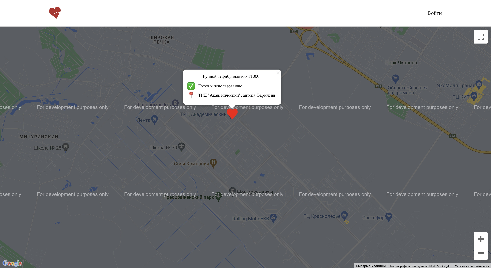
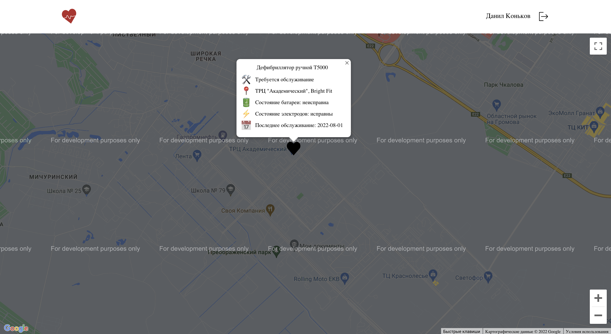
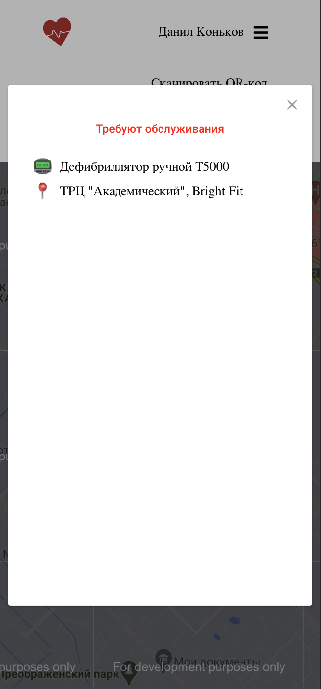

# Frontend для проекта "Карта дефибрилляторов"

Проект создан в рамках производственной практики

    
    

____
## Что готово:

- :white_check_mark: Публичная карта 
    - :white_check_mark: Вывод всех доступных устройств
- :white_check_mark: Личный кабине для сотрудников сервиса
    - :white_check_mark: Добавление новых устройств
    - :white_check_mark: Обновление статуса устройства(в сервисе/готов к использованию)
    - :white_check_mark: Просмотр расширеной информации об устройстве

## Что необходимо доделать:

- :black_square_button: Построение маршрута до устройства