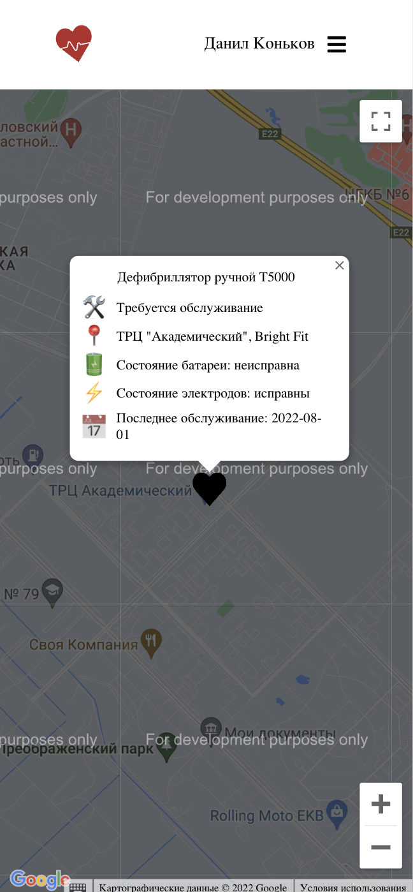

# Frontend для проекта "Карта дефибрилляторов"

Проект создан в рамках производственной практики

    
    

____
## Что готово:

- :white_check_mark: Публичное api
    - :white_check_mark: Вывод списка всех доступных устройств
- :white_check_mark: Api для сотрудников сервиса
    - :white_check_mark: Добавление новых устройств
    - :white_check_mark: Обновление статуса устройства(в сервисе/готов к использованию)
    - :white_check_mark: Логирование всех действий с устройствами
    - :white_check_mark: Получение логов для конкретного устройства

## Что необходимо доделать:

- :black_square_button: Api для устройств
    - :black_square_button: Получение состояния устройства
- :black_square_button: Панель администрирования